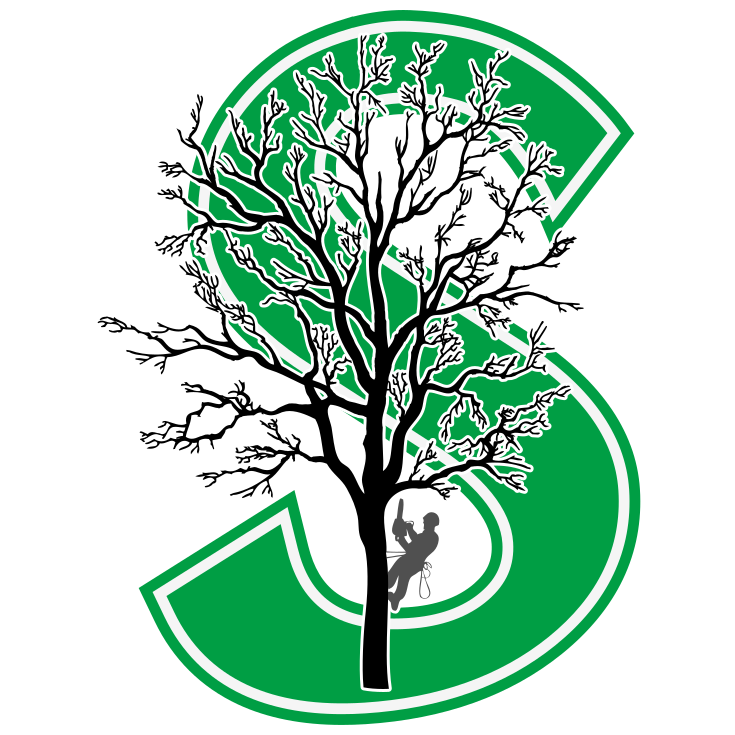

<div id="top"></div>

<!-- PROJECT SHIELDS -->

[![Contributors][contributors-shield]][contributors-url]
[![Forks][forks-shield]][forks-url]
[![Stargazers][stars-shield]][stars-url]
[![Issues][issues-shield]][issues-url]
[![LinkedIn][linkedin-shield]][linkedin-url]

<!-- PROJECT LOGO -->
<br />
<div align="center">
  <a href="https://github.com/raymondkneipp/sherdec">
    
  </a>

<h3 align="center">Sherdec</h3>

  <p align="center">
  Custom website made for a local tree service business.
    <br />
    <a href="https://github.com/raymondkneipp/sherdec"><strong>Explore the docs »</strong></a>
    <br />
    <br />
    <a href="https://sherdec.vercel.app/">View Demo</a>
    ·
    <a href="https://github.com/raymondkneipp/sherdec/issues">Report Bug</a>
    ·
    <a href="https://github.com/raymondkneipp/sherdec/issues">Request Feature</a>
  </p>
</div>

<!-- TABLE OF CONTENTS -->
<details>
  <summary>Table of Contents</summary>
  <ol>
    <li>
      <a href="#about-the-project">About The Project</a>
      <ul>
        <li><a href="#built-with">Built With</a></li>
      </ul>
    </li>
    <li>
      <a href="#getting-started">Getting Started</a>
      <ul>
        <li><a href="#prerequisites">Prerequisites</a></li>
        <li><a href="#installation">Installation</a></li>
      </ul>
    </li>
    <li><a href="#usage">Usage</a></li>
    <li><a href="#contributing">Contributing</a></li>
    <li><a href="#contact">Contact</a></li>
  </ol>
</details>

<!-- ABOUT THE PROJECT -->

## About The Project

[![Sherdec Screen Shot][product-screenshot]](https://sherdec.vercel.app/)

<p align="right">(<a href="#top">back to top</a>)</p>

### Built With

- [Next.js](https://nextjs.org/)
- [React.js](https://reactjs.org/)
- [Tailwindcss](https://tailwindcss.com/)
- [DaisyUI](https://daisyui.com/)

<p align="right">(<a href="#top">back to top</a>)</p>

<!-- GETTING STARTED -->

## Getting Started

To get a local copy up and running follow these simple steps.

### Prerequisites

- [Node.js](https://nodejs.org/en/)
- npm
  ```sh
  npm install npm@latest -g
  ```

### Installation

1. Clone the repo
   ```sh
   git clone https://github.com/raymondkneipp/sherdec.git
   ```
2. Install NPM packages
   ```sh
   npm install
   ```
3. Start local server
   ```sh
   npm run dev
   ```

<p align="right">(<a href="#top">back to top</a>)</p>

<!-- USAGE EXAMPLES -->

## Usage

Feel free to change the information presented on this webpage and create your own website.

<!-- _For more examples, please refer to the [Documentation](https://example.com)_ -->

<p align="right">(<a href="#top">back to top</a>)</p>

<!-- ROADMAP -->

See the [open issues](https://github.com/raymondkneipp/sherdec/issues) for a full list of proposed features (and known issues).

<p align="right">(<a href="#top">back to top</a>)</p>

<!-- CONTRIBUTING -->

## Contributing

Contributions are what make the open source community such an amazing place to learn, inspire, and create. Any contributions you make are **greatly appreciated**.

If you have a suggestion that would make this better, please fork the repo and create a pull request. You can also simply open an issue with the tag "enhancement".
Don't forget to give the project a star! Thanks again!

1. Fork the Project
2. Create your Feature Branch (`git checkout -b feature/AmazingFeature`)
3. Commit your Changes (`git commit -m 'Add some AmazingFeature'`)
4. Push to the Branch (`git push origin feature/AmazingFeature`)
5. Open a Pull Request

<p align="right">(<a href="#top">back to top</a>)</p>

<!-- CONTACT -->

## Contact

Raymond Kneipp - [@rfkquery](https://twitter.com/rfkquery) - hello@raymondkneipp.com

Project Link: [https://github.com/raymondkneipp/sherdec](https://github.com/raymondkneipp/sherdec)

<p align="right">(<a href="#top">back to top</a>)</p>

<!-- MARKDOWN LINKS & IMAGES -->
<!-- https://www.markdownguide.org/basic-syntax/#reference-style-links -->

[contributors-shield]: https://img.shields.io/github/contributors/raymondkneipp/sherdec.svg?style=for-the-badge
[contributors-url]: https://github.com/raymondkneipp/sherdec/graphs/contributors
[forks-shield]: https://img.shields.io/github/forks/raymondkneipp/sherdec.svg?style=for-the-badge
[forks-url]: https://github.com/raymondkneipp/sherdec/network/members
[stars-shield]: https://img.shields.io/github/stars/raymondkneipp/sherdec.svg?style=for-the-badge
[stars-url]: https://github.com/raymondkneipp/sherdec/stargazers
[issues-shield]: https://img.shields.io/github/issues/raymondkneipp/sherdec.svg?style=for-the-badge
[issues-url]: https://github.com/raymondkneipp/sherdec/issues
[linkedin-shield]: https://img.shields.io/badge/-LinkedIn-black.svg?style=for-the-badge&logo=linkedin&colorB=555
[linkedin-url]: https://linkedin.com/in/raymondkneipp
[product-screenshot]: public/images/screenshot.png
